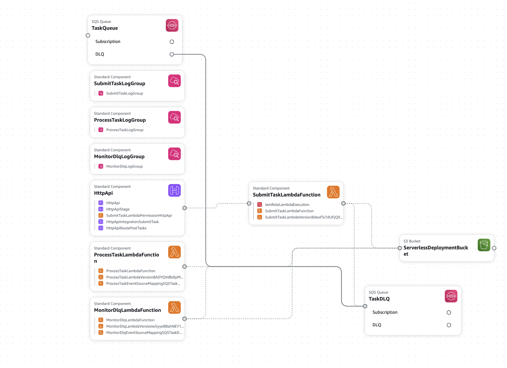

# DLQ Example Project

This project demonstrates a serverless application using AWS services including API Gateway, Lambda, SQS, and Dead Letter Queues (DLQ).

## Architecture



- **API Gateway**: Exposes an HTTP endpoint to receive messages
- **Submit Task Lambda**: Receives HTTP requests and sends messages to SQS
- **Processing SQS queue**: Main queue for message processing
- **Processing Task Lambda**: Simulates message processing. Simulates failure for 30% of messages
- **Dead Letter Queue (DLQ)**: Captures failed messages after multiple processing attempts (uses out-of-the-box functionality of SQS)
- **Monitor DLQ Lambda**: Monitors the Dead Letter Queue and logs details of failed tasks into a dedicated CloudWatch log group
- **CloudWatch Log Groups**:
  - `/aws/lambda/dlq-example-dev-submitTask`: Logs for the Submit Task Lambda
  - `/aws/lambda/dlq-example-dev-processTask`: Logs for the Processing Task Lambda
  - `/aws/lambda/dlq-example-dev-monitorDlq`: Logs for the Monitor DLQ Lambda
  - `/aws/lambda/dlq-example-dev-dlqFailures`: Special log group for detailed failed task information

## Setup

### Prerequisites

- Node.js (v14+)
- AWS CLI
- Serverless Framework

### Installation

```bash
# Install dependencies
npm install
```

### Environment Variables

Copy the `.env.example` file to create your own `.env` file:

```bash
cp .env.example .env
```

Then edit the `.env` file to set your specific configuration values:

- `AWS_REGION`: Your AWS region (default: us-east-1)
- `AWS_PROFILE`: Your AWS CLI profile name (default: default)
- `STAGE`: Deployment stage (dev, staging, prod)

After deployment, update these values with the actual ARNs and URLs:
- `QUEUE_URL`: The URL of your SQS queue
- `DLQ_URL`: The URL of your Dead Letter Queue
- `API_GATEWAY_URL`: The URL of your deployed API Gateway endpoint

### AWS Credentials and Permissions

To use this project, you need AWS credentials with specific permissions to deploy and run the application.

#### Required AWS Managed Policies

The AWS user needs the following managed policies:
Unfortunately the list is WAY TOO permissive. It will be fixed in next iteration

```
AmazonAPIGatewayAdministrator
AmazonDynamoDBFullAccess
AmazonS3FullAccess
AmazonSNSFullAccess
AmazonSQSFullAccess
AWSCloudFormationFullAccess
AWSLambda_FullAccess
AWSStepFunctionsFullAccess
CloudWatchFullAccess
CustomIAMCreateRole (Customer managed)
```

#### Required IAM Permissions

Additionally, the following specific permissions are needed:

```
logs:CreateLogStream
sqs:ChangeMessageVisibility
iam:UntagRole
iam:TagRole
iam:CreateRole
iam:DeleteRole
iam:PutRolePolicy
logs:PutLogEvents
```

#### Getting AWS Access Keys

1. Log in to the AWS Management Console
2. Navigate to IAM (Identity and Access Management)
3. Select "Users" from the left sidebar and click "Create user"
4. Enter a username and click "Next"
5. Select "Attach policies directly" and attach all the required policies listed above
6. Click "Next" and then "Create user"
7. Click on the newly created user and select the "Security credentials" tab
8. Under "Access keys", click "Create access key"
9. Select "Command Line Interface (CLI)" and click "Next"
10. Click "Create access key" and download or copy your access key ID and secret access key

#### Configuring AWS Credentials

Set up your AWS credentials using one of these methods:

```bash
# Using AWS CLI
aws configure --profile your-profile-name

# Using environment variables
export AWS_ACCESS_KEY_ID=your-access-key
export AWS_SECRET_ACCESS_KEY=your-secret-key
export AWS_REGION=us-east-1
```

Or add them to your `.env` file:
```
AWS_ACCESS_KEY_ID=your-access-key
AWS_SECRET_ACCESS_KEY=your-secret-key
AWS_REGION=us-east-1
```

## Deployment

To deploy the application to AWS:

```bash
# Deploy to default stage (dev)
npm run deploy

# Deploy to a specific stage
npm run deploy -- --stage prod
```

After deployment, the output will show your API Gateway endpoint URL. Save this URL for testing.

## Testing

### Getting the API URL

When you run `npm run deploy`, the API endpoint URL is displayed directly in the terminal output. Look for a line similar to:

```
endpoint: POST - https://xxxxxxxxxxxx.execute-api.region.amazonaws.com/tasks
```

This is your API endpoint URL. Use this URL for all your API calls.

### Making API Calls

Send a regular message:

```bash
curl -X POST https://your-api-endpoint/tasks \
  -H "Content-Type: application/json" \
  -d '{"message": "Hello world", "type": "default"}'
```

Simulate a failed message (will go to DLQ after retries):

```bash
curl -X POST https://your-api-endpoint/tasks \
  -H "Content-Type: application/json" \
  -d '{"message": "This will fail", "simulateError": true}'
```

### Load Testing

To send multiple messages in quick succession using a bash loop:

```bash
API_URL="https://your-api-endpoint/tasks"

# Send 10 regular messages
for i in {1..10}; do
  curl -X POST $API_URL \
    -H "Content-Type: application/json" \
    -d "{\"message\": \"Message $i\", \"type\": \"default\"}"
  echo ""
  sleep 0.2
done
```

## Local Development

### Running the Service Locally

Start the local development server:

```bash
npm run dev
```

This will start the Serverless Offline plugin, which emulates API Gateway and Lambda locally.

### Testing Locally

Once the local server is running, you can test it with:

```bash
# Send a test message
curl -X POST http://localhost:3000/tasks \
  -H "Content-Type: application/json" \
  -d '{"message": "Local test", "type": "default"}'

# Simulate an error
curl -X POST http://localhost:3000/tasks \
  -H "Content-Type: application/json" \
  -d '{"message": "Local error test", "simulateError": true}'
```

### Local SQS and DLQ

For full local testing with SQS and DLQ, you can use [elasticmq](https://github.com/softwaremill/elasticmq) or [localstack](https://github.com/localstack/localstack).

## Monitoring

- Check CloudWatch Logs for Lambda function logs
- View the SQS queue metrics in CloudWatch
- Monitor the DLQ for failed messages
